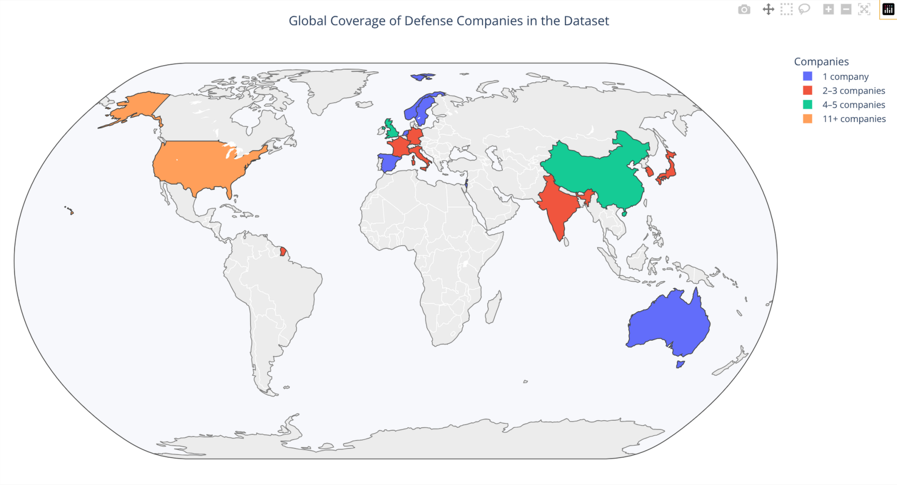
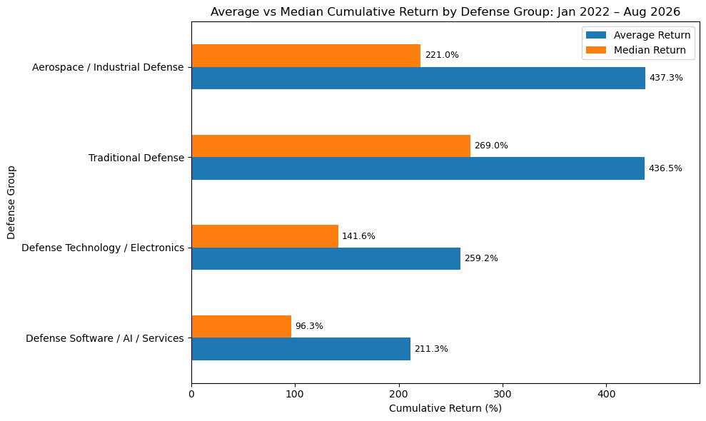
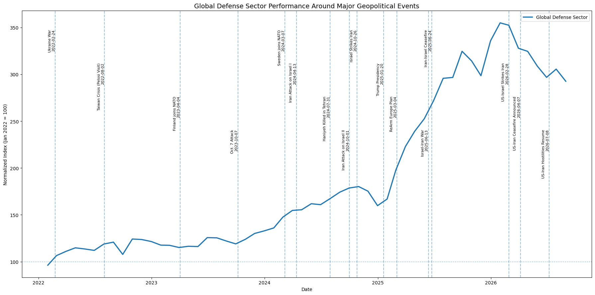
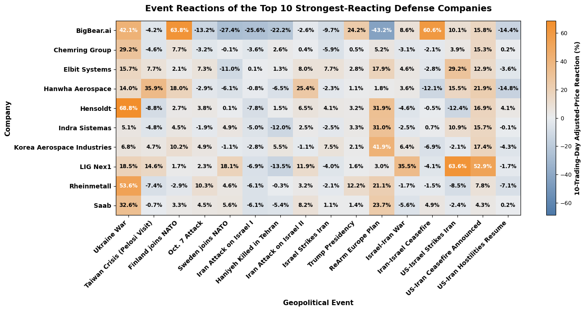
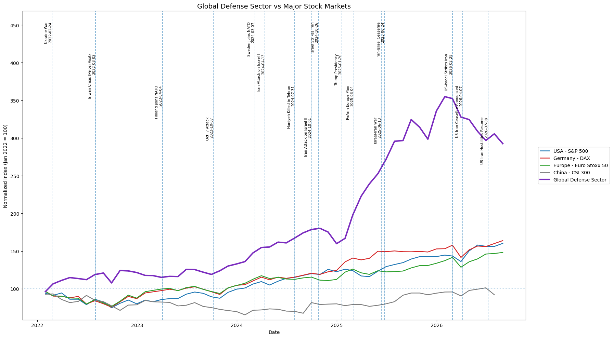
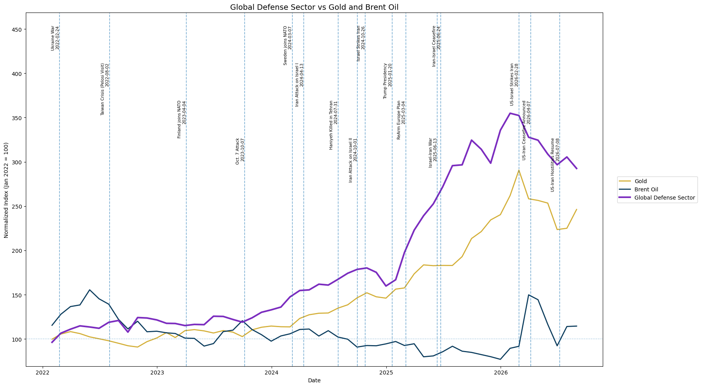

# Global Defense Sector Analysis

**Language:** English | [Deutsch](README_DE.md)

This data-analysis project examines 42 publicly traded defense-related companies from 15 countries
between January 2022 and August 2026.

## Project Overview

It combines financial-market analysis with geopolitical context. The analysis covers cumulative
returns, volatility, business groups, geographic coverage, geopolitical event reactions, trading
volume, correlations, and performance relative to major market benchmarks.

| Item | Scope |
|---|---|
| Companies | 42 publicly traded defense-related companies |
| Countries | 15 |
| Analysis period | January 2022 – August 2026 |
| Clean stock observations | 48,915 |
| Business groups | 4 analytical groups |
| Geopolitical events | 16 events, February 2022 – July 2026 |
| Benchmarks | S&P 500, DAX, Euro Stoxx 50, CSI 300, Gold, Brent Oil |
| Main tools | Python, pandas, NumPy, Matplotlib, Plotly, yfinance |
| Dashboard | Power BI planned |

## Analytical Scope

The analysis addresses twelve complementary questions, among them:

- which companies generated the strongest cumulative returns
- how average and median performance differed across defense business groups
- how geographically broad the company sample is
- how individual companies and the custom defense-sector index behaved around major geopolitical
  events
- which stocks were most volatile, and which offered the strongest return relative to volatility
- where trading-volume spikes occurred and which companies moved most closely together
- whether the defense-sector sample outperformed major financial-market benchmarks

## Data and Methodology

Historical market data were obtained through Yahoo Finance using `yfinance`. Price data were
downloaded with `auto_adjust=True`, so return calculations use adjusted closing prices that
incorporate corporate-action adjustments such as splits and cash dividends. Returns are calculated
in each security's local trading currency and are not adjusted for foreign-exchange movements.

Companies are classified at two levels. `Defense_Type` provides a detailed description of the
company's main defense-related activity, while `Analysis_Group` combines them into four broader
analytical categories:

- Traditional Defense
- Aerospace / Industrial Defense
- Defense Technology / Electronics
- Defense Software / AI / Services

The custom global defense-sector index is constructed by normalizing each company to 100 at the
beginning of the analysis period, converting the series to monthly observations, and taking the
median across the company sample. It is a sample-based analytical index, not a market-cap-weighted
or investable index.

### Geopolitical Events

Sixteen events between February 2022 and July 2026 were selected and dated manually. They cover the
war in Ukraine, NATO enlargement, the Middle East escalations of 2023–2026, European rearmament
policy and the change in US administration. Selection focused on developments with plausible
relevance for defense procurement or regional security expectations.

Event dates refer to the date on which the event occurred, not the date on which markets first
traded on it. Several events fall on weekends or market holidays, so the notebook maps each event to
the nearest available trading day for short-term reactions, and to the first month-end strictly
after the event for index levels.

Short-term event reactions compare adjusted prices five trading days before and five trading days
after selected geopolitical events. Trading-volume reactions compare average volume during the five
trading days before an event with the five trading days after it. These measures describe market
reactions around event dates and do not establish causality.

## Visual Highlights

### Global Company Coverage



The sample spans major listed defense markets across North America, Europe, Asia, Australia and
Israel. Country representation is intentionally broad but not evenly weighted.

### Average vs Median Return by Defense Group



Aerospace / Industrial Defense and Traditional Defense had the highest average cumulative returns.
The median comparison changes the interpretation: Traditional Defense had the highest median return,
while the Aerospace / Industrial Defense average was more strongly influenced by exceptionally
high-performing companies.

### Defense Sector and Geopolitical Events



The custom defense-sector index shows a strong long-term increase, with particularly rapid growth
from 2024 into 2025 and a peak in early 2026. Event markers provide geopolitical context and are not
interpreted as proof of causality.

### Short-Term Event Reactions



Short-term reactions varied substantially across companies and events. The same companies did not
react uniformly to every geopolitical development, highlighting the importance of company-specific
exposure and market expectations.

### Defense Sector vs Major Stock Markets



Within this sample and analysis period, the custom defense-sector index substantially outperformed
the selected major stock-market benchmarks.

### Defense Sector vs Gold and Brent Oil



Gold also performed strongly, especially from 2024 onward, while Brent oil was considerably more
volatile. The custom defense-sector index finished the period above both comparison assets.

## Selected Findings

Fourteen of the 42 companies gained more than 500% over the analysis period, led by Hanwha
Aerospace, Mitsubishi Heavy Industries, Rheinmetall, Saab and LIG Nex1. Five companies ended the
period with negative cumulative returns, so performance across the sector was highly uneven.

Traditional Defense had the highest median cumulative return among the four analytical groups, while
Aerospace / Industrial Defense had a similarly high average but a lower median, showing the
influence of extreme high performers.

Company-level risk also differed sharply. BigBear.ai showed the highest annualized return volatility
in the sample. Event-window analysis identified large but highly heterogeneous price and
trading-volume reactions around major geopolitical developments, with the Ukraine War associated
with some of the strongest reactions in the dataset.

The custom defense-sector index reached its highest monthly level at about 355 in January 2026 and
ended August 2026 at about 293. Within the selected sample, it substantially outperformed the S&P
500, DAX, Euro Stoxx 50 and CSI 300 over the study period, and ended above gold and Brent oil.

## How to Run

The repository includes the cleaned CSV files used for the final analysis, so the notebook can be
reviewed without re-downloading any market data.

```bash
pip install pandas numpy matplotlib plotly yfinance jupyter
jupyter notebook global_defense_sector_analysis.ipynb
```

Python 3.10 or later is recommended. Running the notebook from the top re-downloads the data from
Yahoo Finance and overwrites the CSV files; skip the download cells to work with the stored dataset
instead.

## Power BI Dashboard

**Status: Planned**

The Python notebook contains the full analytical workflow. Power BI will be used as an interactive
presentation layer rather than as a replacement for the Python analysis.

The planned dashboard will contain two pages.

### Page 1 — Market & Company Overview

- KPI cards: number of companies, countries, analysis period and selected-company metrics
- Interactive country map
- Average vs median cumulative return by `Analysis_Group`
- Company performance chart with company, country and business-group filters
- Comparison of the custom defense-sector index with major stock-market benchmarks, gold and Brent
  oil
- Slicers for company, country, analysis group and date

### Page 2 — Geopolitical Event Analysis

- Defense-sector timeline with selected geopolitical events
- Interactive company/event reaction matrix
- Trading-volume reaction matrix
- Top positive and negative event reactions
- Filters for event, company, country and business group

The Power BI data model will use:

- `date_table[Date]` → `defense_stocks_clean[Date]` (1:* relationship)
- `date_table[Date]` → `market_benchmarks[Date]` (1:* relationship)
- `company_metadata[Ticker]` → `defense_stocks_clean[Ticker]` (1:* relationship)

In Power BI, `Month_Name` should be sorted by the numeric `Month` column.

When the dashboard is completed, the `.pbix` file and one or two dashboard screenshots will be added
to the `powerbi/` folder.

## Repository Structure

```text
global-defense-sector-analysis/
│
├── README.md
├── README_DE.md
├── global_defense_sector_analysis.ipynb
│
├── data/
│   ├── defense_stocks_clean.csv
│   ├── company_metadata.csv
│   ├── market_benchmarks.csv
│   └── date_table.csv
│
├── images/
│   ├── global_company_coverage.png
│   ├── average_vs_median_returns.png
│   ├── defense_sector_geopolitical_events.png
│   ├── geopolitical_event_reactions.png
│   ├── defense_sector_vs_stock_markets.png
│   └── defense_sector_vs_gold_oil.png
│
└── powerbi/
    └── Power BI dashboard files and screenshots will be added here
```

The notebook writes its export files to the working directory. The CSV files are stored under
`data/` in this repository and were moved there after the final run.

## Files

- [global_defense_sector_analysis.ipynb](global_defense_sector_analysis.ipynb) — full analysis notebook
- [data/defense_stocks_clean.csv](data/defense_stocks_clean.csv) — cleaned daily price data, 48,915 rows
- [data/company_metadata.csv](data/company_metadata.csv) — ticker, company, country, currency and groups
- [data/market_benchmarks.csv](data/market_benchmarks.csv) — benchmark series, raw and normalized
- [data/date_table.csv](data/date_table.csv) — date table for the Power BI model

## Tools

- Python
- pandas
- NumPy
- Matplotlib
- Plotly
- yfinance
- Jupyter Notebook
- Power BI (planned)

## AI-Assisted Workflow

AI assistants were used as supporting tools for coding assistance, debugging, methodological review
and documentation.

I defined the project scope, selected the companies and research questions, reviewed the outputs
against the underlying data, and made the final analytical and methodological decisions.
AI-generated suggestions were tested, corrected, modified or rejected when they did not fit the
data, methodology or purpose of the analysis.

## Limitations

- The company sample is internationally diverse but geographically uneven and does not represent the
  complete global defense industry.
- Returns are calculated in local trading currencies and are not FX-adjusted.
- The custom defense-sector index is sample-based, median-based and not market-cap weighted.
- Event-window results show associations and short-term market reactions, not causal effects.
- The selection and dating of geopolitical events reflect analytical judgement; a different event
  set could produce different short-term results.
- International markets have different trading calendars and time zones.
- The CSI 300 benchmark in the downloaded dataset ends on 17 July 2026, while the other benchmark
  series extend through August 2026.
- The return-to-risk measure used in the notebook is a simplified ratio of annualized return to
  annualized volatility and is not a Sharpe ratio.
- Yahoo Finance data may change when downloaded again in the future; the repository CSV files
  preserve the dataset used for this analysis.
- Adjusted closing prices may produce results that differ from calculations using raw closing prices
  or a dedicated total-return index.

## Notes on Reproducibility

The repository includes the cleaned CSV files used for the final analysis. This makes the analyzed
data snapshot available even if future Yahoo Finance downloads change. The notebook documents the
complete workflow from data acquisition and cleaning through analysis, visualization and Power BI
preparation.

---

This project is intended as a data-analysis portfolio project and not as investment advice.
