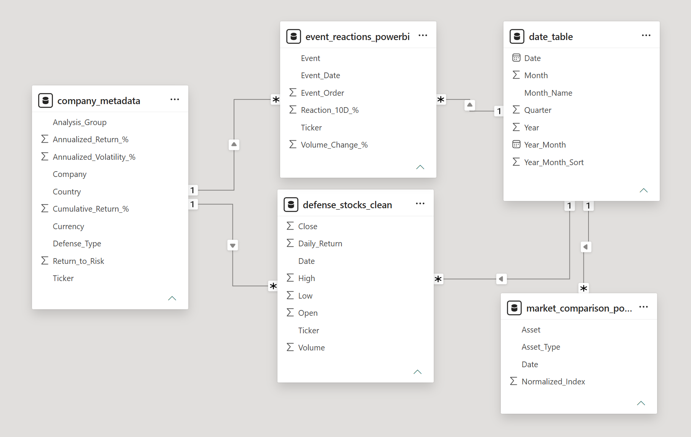
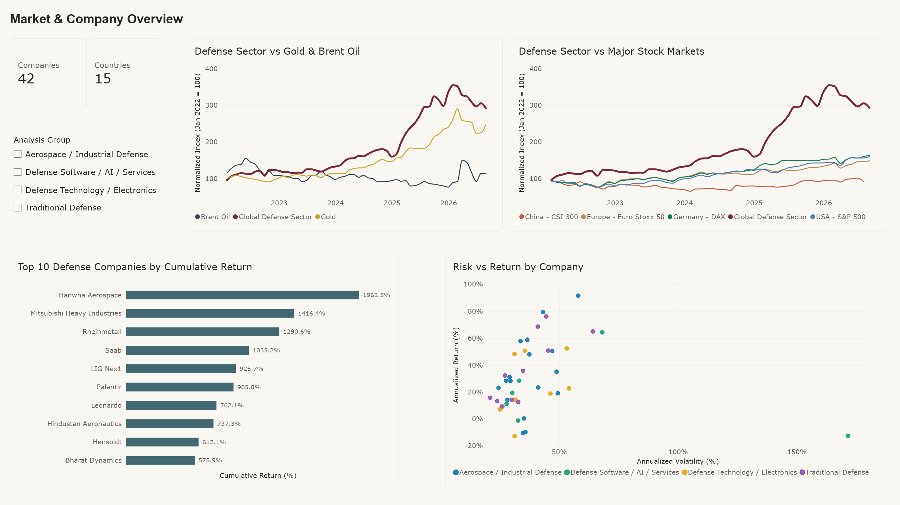
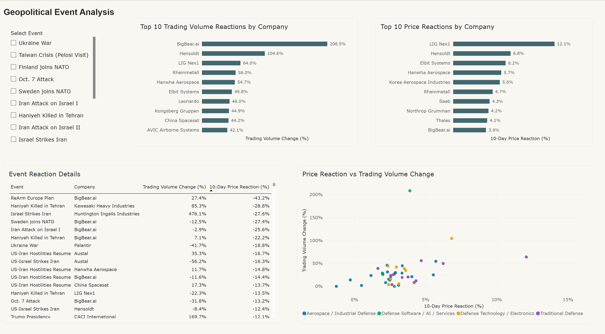

# Globale Analyse des Verteidigungssektors

**Sprache:** Deutsch | [English](README.md)

Das Projekt analysiert 42 börsennotierte verteidigungsbezogene Unternehmen aus 15 Ländern zwischen
Januar 2022 und August 2026.

## Projektüberblick

Es verbindet Finanzmarktanalyse mit geopolitischem Kontext. Betrachtet werden kumulative Renditen,
Volatilität, Geschäftsgruppen, geografische Abdeckung, Reaktionen auf geopolitische Ereignisse,
Handelsvolumen, Korrelationen und die Entwicklung im Vergleich zu wichtigen Marktbenchmarks.

| Punkt | Umfang |
|---|---|
| Unternehmen | 42 börsennotierte verteidigungsbezogene Unternehmen |
| Länder | 15 |
| Analysezeitraum | Januar 2022 – August 2026 |
| Bereinigte Kursbeobachtungen | 48.915 |
| Geschäftsgruppen | 4 analytische Gruppen |
| Geopolitische Ereignisse | 16 Ereignisse, Februar 2022 – Juli 2026 |
| Benchmarks | S&P 500, DAX, Euro Stoxx 50, CSI 300, Gold, Brent Oil |
| Hauptwerkzeuge | Python, pandas, NumPy, Matplotlib, Plotly, yfinance |
| Dashboard | Power BI, zwei interaktive Berichtsseiten |

## Analytischer Umfang

Die Untersuchung geht zwölf miteinander verbundenen Fragestellungen nach, darunter:

- welche Unternehmen die höchsten kumulativen Renditen erzielten
- wie sich Mittelwert und Median zwischen den Geschäftsgruppen unterscheiden
- wie breit die geografische Abdeckung der Stichprobe ist
- wie sich einzelne Unternehmen und der eigens konstruierte Verteidigungssektor-Index rund um
  wichtige geopolitische Ereignisse verhielten
- welche Aktien besonders volatil waren und welche die höchste Rendite im Verhältnis zur Volatilität
  erzielten
- wo starke Handelsvolumenspitzen auftraten und welche Unternehmen sich besonders ähnlich bewegten
- ob die Stichprobe des Verteidigungssektors wichtige Finanzmarktbenchmarks übertraf

## Daten und Methodik

Historische Marktdaten wurden über Yahoo Finance mit `yfinance` bezogen. Die Kursdaten wurden mit
`auto_adjust=True` geladen. Die Renditeberechnungen verwenden daher angepasste Schlusskurse, die
unter anderem Kapitalmaßnahmen wie Splits und Bardividenden berücksichtigen. Die Renditen werden in
der jeweiligen lokalen Handelswährung berechnet und nicht um Wechselkursbewegungen bereinigt.

Die Unternehmen werden auf zwei Ebenen klassifiziert. `Defense_Type` beschreibt die jeweilige
verteidigungsbezogene Haupttätigkeit detaillierter. `Analysis_Group` fasst diese Kategorien für
Vergleiche in vier größere analytische Gruppen zusammen:

- Traditional Defense
- Aerospace / Industrial Defense
- Defense Technology / Electronics
- Defense Software / AI / Services

Der benutzerdefinierte globale Verteidigungssektor-Index wird konstruiert, indem jedes Unternehmen
zu Beginn des Analysezeitraums auf 100 normiert, anschließend auf Monatswerte reduziert und danach
der Median über die Unternehmensstichprobe gebildet wird. Es handelt sich um einen analytischen
Stichprobenindex und nicht um einen marktkapitalisierungsgewichteten oder investierbaren Index.

### Geopolitische Ereignisse

Sechzehn Ereignisse zwischen Februar 2022 und Juli 2026 wurden manuell ausgewählt und datiert. Sie
umfassen den Krieg in der Ukraine, die NATO-Erweiterung, die Eskalationen im Nahen Osten von 2023
bis 2026, die europäische Aufrüstungspolitik und den Regierungswechsel in den USA. Die Auswahl
konzentriert sich auf Entwicklungen mit plausibler Relevanz für Rüstungsbeschaffung oder regionale
Sicherheitserwartungen.

Die Ereignisdaten beziehen sich auf den Tag des Ereignisses, nicht auf den Tag, an dem die Märkte
erstmals darauf reagieren konnten. Mehrere Ereignisse fallen auf Wochenenden oder Feiertage. Das
Notebook ordnet daher jedem Ereignis für die kurzfristigen Reaktionen den nächstgelegenen
verfügbaren Handelstag zu und für die Indexstände das erste Monatsende strikt nach dem Ereignis.

Kurzfristige Ereignisreaktionen vergleichen angepasste Kurse fünf Handelstage vor und fünf
Handelstage nach ausgewählten geopolitischen Ereignissen. Bei der Handelsvolumenanalyse wird das
durchschnittliche Volumen der fünf Handelstage vor einem Ereignis mit den fünf Handelstagen danach
verglichen. Diese Kennzahlen beschreiben Marktreaktionen rund um Ereignisdaten und belegen keine
Kausalität.

## Visuelle Highlights

### Globale Unternehmensabdeckung


Die Stichprobe umfasst wichtige börsennotierte Verteidigungsmärkte in Nordamerika, Europa, Asien,
Australien und Israel. Die Länderabdeckung ist bewusst breit, aber nicht gleichmäßig gewichtet.

### Mittelwert vs. Median nach Verteidigungsgruppe


Aerospace / Industrial Defense und Traditional Defense erzielten die höchsten durchschnittlichen
kumulativen Renditen. Der Median verändert jedoch die Interpretation: Traditional Defense weist den
höchsten Median auf, während der Durchschnitt von Aerospace / Industrial Defense stärker durch
einzelne außergewöhnlich starke Unternehmen beeinflusst wird.

### Verteidigungssektor und geopolitische Ereignisse


Der benutzerdefinierte Verteidigungssektor-Index zeigt langfristig einen starken Anstieg, besonders
von 2024 bis 2025, und erreicht Anfang 2026 seinen Höchststand. Die Ereignismarkierungen liefern
geopolitischen Kontext und werden nicht als Beweis für Kausalität interpretiert.

### Kurzfristige Ereignisreaktionen


Die kurzfristigen Reaktionen unterscheiden sich stark zwischen Unternehmen und Ereignissen.
Dieselben Unternehmen reagierten nicht auf jedes geopolitische Ereignis gleich, was die Bedeutung
unternehmensspezifischer Exposition und Markterwartungen unterstreicht.

### Verteidigungssektor vs. große Aktienmärkte


Innerhalb dieser Stichprobe und dieses Analysezeitraums entwickelte sich der benutzerdefinierte
Verteidigungssektor-Index deutlich stärker als die ausgewählten großen Aktienmarktbenchmarks.

### Verteidigungssektor vs. Gold und Brent Oil


Auch Gold entwickelte sich besonders ab 2024 stark, während Brent Oil deutlich volatiler war. Der
benutzerdefinierte Verteidigungssektor-Index beendete den Analysezeitraum über beiden
Vergleichsanlagen.

## Ausgewählte Ergebnisse

Vierzehn der 42 Unternehmen legten im Analysezeitraum um mehr als 500 % zu, angeführt von Hanwha
Aerospace, Mitsubishi Heavy Industries, Rheinmetall, Saab und LIG Nex1. Fünf Unternehmen beendeten
den Zeitraum mit negativer kumulativer Rendite. Die Performance innerhalb des Sektors war damit sehr
ungleichmäßig.

Traditional Defense hatte unter den vier analytischen Gruppen den höchsten Median der kumulativen
Rendite. Aerospace / Industrial Defense erreichte einen ähnlich hohen Durchschnitt, aber einen
niedrigeren Median, was den Einfluss besonders starker Ausreißer zeigt.

Auch beim Risiko gab es deutliche Unterschiede. BigBear.ai wies die höchste annualisierte
Renditevolatilität der Stichprobe auf. Die Ereignisfenster zeigten große, aber sehr heterogene Kurs-
und Handelsvolumenreaktionen rund um wichtige geopolitische Entwicklungen. Besonders rund um den
Ukraine-Krieg traten einige der stärksten Reaktionen des Datensatzes auf.

Der benutzerdefinierte Verteidigungssektor-Index erreichte im Januar 2026 seinen höchsten Monatswert
von ungefähr 355 und lag Ende August 2026 bei ungefähr 293. Innerhalb der ausgewählten Stichprobe
entwickelte er sich im Analysezeitraum deutlich stärker als S&P 500, DAX, Euro Stoxx 50 und CSI 300
und beendete den Zeitraum über Gold und Brent Oil.

## Ausführung

Das Repository enthält die bereinigten CSV-Dateien der finalen Analyse. Das Notebook lässt sich
daher nachvollziehen, ohne die Marktdaten erneut herunterzuladen.

```bash
pip install pandas numpy matplotlib plotly yfinance jupyter
jupyter notebook global_defense_sector_analysis.ipynb
```

Empfohlen wird Python 3.10 oder neuer. Ein vollständiger Durchlauf des Notebooks lädt die Daten
erneut von Yahoo Finance und überschreibt dabei die CSV-Dateien. Wer mit dem gespeicherten
Datenstand arbeiten möchte, überspringt die Download-Zellen.

## Power-BI-Dashboard

Das Python-Notebook enthält den vollständigen analytischen Workflow. Power BI dient als interaktive
Präsentationsebene und ersetzt die Python-Analyse nicht. Der Bericht baut auf den CSV-Tabellen auf,
die das Notebook exportiert, und erlaubt es, nach Geschäftsgruppe und nach geopolitischem Ereignis
zu filtern, ohne den Code erneut auszuführen. Er wiederholt nicht jede Fragestellung des Notebooks,
sondern konzentriert sich auf die Teile, die von Interaktivität profitieren.

### Datenmodell



Das Modell ist ein Sternschema mit zwei Dimensionstabellen und drei analytischen Tabellen.

| Tabelle | Rolle | Zeilen | Granularität |
|---|---|---|---|
| `company_metadata` | Dimension | 42 | eine Zeile je Unternehmen |
| `date_table` | Dimension | 1.704 | eine Zeile je Kalendertag, 1. Januar 2022 – 31. August 2026 |
| `defense_stocks_clean` | Fakten | 48.915 | eine Zeile je Unternehmen und Handelstag |
| `market_comparison_powerbi` | Fakten | 391 | eine Zeile je Anlage und Monatsende |
| `event_reactions_powerbi` | Fakten | 672 | eine Zeile je Ereignis und Unternehmen |

Alle Beziehungen sind 1:n und filtern in eine Richtung, von der Dimensionstabelle zur analytischen
Tabelle:

- `company_metadata[Ticker]` → `defense_stocks_clean[Ticker]`
- `company_metadata[Ticker]` → `event_reactions_powerbi[Ticker]`
- `date_table[Date]` → `defense_stocks_clean[Date]`
- `date_table[Date]` → `market_comparison_powerbi[Date]`
- `date_table[Date]` → `event_reactions_powerbi[Event_Date]`

Die Datumsdimension enthält jeden Kalendertag, damit Monats- und Quartalsfilter korrekt arbeiten,
während die Kurstabelle nur Handelstage enthält. `Month_Name` wird über die numerische Spalte
`Month` sortiert. Rendite- und Volatilitätsspalten sind als Prozentwerte gespeichert, etwa `25.4`
für 25,4 %, und bleiben in Power BI Dezimalzahlenspalten, werden also nicht erneut mit 100
multipliziert. Die Eindeutigkeit der Schlüssel und die Fremdschlüsselintegrität werden im Notebook
geprüft, bevor die Tabellen exportiert werden.

### Seite 1 — Markt- und Unternehmensüberblick



Die erste Seite zeigt Stichprobenumfang, Sektorentwicklung und unternehmensbezogenes Risiko:

- Karten mit dem Umfang der Stichprobe, 42 Unternehmen aus 15 Ländern
- ein Datenschnitt für die vier analytischen Geschäftsgruppen, der alle Visuals der Seite filtert
- der benutzerdefinierte Verteidigungssektor-Index im Vergleich zu Gold und Brent Oil, indexiert auf
  Januar 2022 = 100
- derselbe Index im Vergleich zu S&P 500, DAX, Euro Stoxx 50 und CSI 300
- die führenden Unternehmen nach kumulativer Rendite im Analysezeitraum
- ein Streudiagramm aus annualisierter Volatilität und annualisierter Rendite, eingefärbt nach
  Geschäftsgruppe

Die Reihe des CSI 300 endet früher als die übrigen Benchmarks, weil die zugrunde liegende
Datenquelle dort aufhört. Das ist unter Einschränkungen dokumentiert und kein Datenfehler.

### Seite 2 — Geopolitische Ereignisanalyse



Die zweite Seite macht die Ereignisanalyse interaktiv:

- ein Datenschnitt mit den 16 geopolitischen Ereignissen des Analysezeitraums
- die größten durchschnittlichen Veränderungen des Handelsvolumens im Ereignisfenster, angeführt von
  BigBear.ai mit 208,5 %
- die größten durchschnittlichen 10-Tage-Kursreaktionen, angeführt von LIG Nex1 mit 12,1 %
- eine Detailtabelle mit jeder Kombination aus Ereignis und Unternehmen, nach beiden Kennzahlen
  sortierbar
- ein Streudiagramm aus Kursreaktion und Volumenveränderung, eingefärbt nach Geschäftsgruppe

Ohne ausgewähltes Ereignis zeigen die Visuals den Durchschnitt über alle 16 Ereignisse. Wird im
Datenschnitt ein Ereignis ausgewählt, beziehen sich alle Visuals nur darauf. So lässt sich etwa die
Marktreaktion auf den Beginn des Krieges in der Ukraine mit der Reaktion auf den ReArm-Europe-Plan
vergleichen.

Wie im Notebook beschreiben die Ereignisfenster das Marktgeschehen rund um ein Ereignisdatum. Sie
belegen nicht, dass das Ereignis die Bewegung verursacht hat.

## Repository-Struktur

```text
global-defense-sector-analysis/
│
├── README.md
├── README_DE.md
├── global_defense_sector_analysis.ipynb
│
├── data/
│   ├── defense_stocks_clean.csv
│   ├── company_metadata.csv
│   ├── date_table.csv
│   ├── market_comparison_powerbi.csv
│   └── event_reactions_powerbi.csv
│
├── images/
│   ├── global_company_coverage.png
│   ├── average_vs_median_returns.png
│   ├── defense_sector_geopolitical_events.png
│   ├── geopolitical_event_reactions.png
│   ├── defense_sector_vs_stock_markets.png
│   ├── defense_sector_vs_gold_oil.png
│   ├── star_schema_defense_power_bi.png
│   ├── market_company_overview_power_bi.png
│   └── geopolitical_event_analysis_power_bi.png
│
└── powerbi/
    └── global_defense_sector_analysis.pbix
```

Das Notebook schreibt seine Exportdateien in das Arbeitsverzeichnis. Die CSV-Dateien liegen in
diesem Repository unter `data/` und wurden nach dem finalen Durchlauf dorthin verschoben. Der
Power-BI-Bericht verwendet dieselben fünf Tabellen.

## Dateien

- [global_defense_sector_analysis.ipynb](global_defense_sector_analysis.ipynb) — vollständiges Analyse-Notebook
- [data/defense_stocks_clean.csv](data/defense_stocks_clean.csv) — bereinigte Kursdaten, 48.915 Zeilen
- [data/company_metadata.csv](data/company_metadata.csv) — Unternehmensdimension mit Land, Währung, Gruppen und Kennzahlen, 42 Zeilen
- [data/date_table.csv](data/date_table.csv) — Datumsdimension für das Power-BI-Modell, 1.704 Zeilen
- [data/market_comparison_powerbi.csv](data/market_comparison_powerbi.csv) — normierter Monatsindex für den Sektor und alle Benchmarks, 391 Zeilen
- [data/event_reactions_powerbi.csv](data/event_reactions_powerbi.csv) — Kurs- und Handelsvolumenreaktionen je Ereignis und Unternehmen, 672 Zeilen

## Werkzeuge

- Python
- pandas
- NumPy
- Matplotlib
- Plotly
- yfinance
- Jupyter Notebook
- Power BI

## KI-unterstützter Workflow

KI-Assistenten wurden als unterstützende Werkzeuge für Coding, Debugging, methodische Überprüfung
und Dokumentation eingesetzt.

Projektumfang, Unternehmensauswahl und Forschungsfragen wurden von mir festgelegt. Ich habe die
Ergebnisse anhand der zugrunde liegenden Daten geprüft und die endgültigen analytischen und
methodischen Entscheidungen selbst getroffen. KI-generierte Vorschläge wurden getestet, korrigiert,
angepasst oder verworfen, wenn sie nicht zu den Daten, zur Methodik oder zum Ziel der Analyse
passten.

## Einschränkungen

- Die Unternehmensstichprobe ist international breit, geografisch jedoch ungleich verteilt und
  bildet nicht die gesamte globale Verteidigungsindustrie ab.
- Renditen werden in den jeweiligen lokalen Handelswährungen berechnet und sind nicht
  wechselkursbereinigt.
- Der benutzerdefinierte Verteidigungssektor-Index basiert auf dem Median der Stichprobe und ist
  nicht marktkapitalisierungsgewichtet.
- Ereignisfenster zeigen Zusammenhänge und kurzfristige Marktreaktionen, aber keine Kausalität.
- Auswahl und Datierung der geopolitischen Ereignisse beruhen auf analytischer Einschätzung; eine
  andere Ereignisauswahl könnte zu anderen kurzfristigen Ergebnissen führen.
- Internationale Märkte haben unterschiedliche Handelstage und Zeitzonen.
- Der CSI-300-Benchmark im heruntergeladenen Datensatz endet am 17. Juli 2026, während die anderen
  Benchmarkreihen bis August 2026 reichen.
- Die Return-to-Risk-Kennzahl des Notebooks ist ein vereinfachtes Verhältnis aus annualisierter
  Rendite und annualisierter Volatilität und kein Sharpe Ratio.
- Yahoo-Finance-Daten können sich bei zukünftigen Downloads verändern; die im Repository
  gespeicherten CSV-Dateien sichern den für diese Analyse verwendeten Datenstand.
- Angepasste Schlusskurse können zu anderen Ergebnissen führen als Berechnungen mit nicht
  angepassten Schlusskursen oder einem speziellen Total-Return-Index.

## Reproduzierbarkeit

Das Repository enthält die bereinigten CSV-Dateien, die für die finale Analyse verwendet wurden.
Dadurch bleibt der analysierte Datenstand verfügbar, auch wenn sich zukünftige
Yahoo-Finance-Downloads verändern. Das Notebook dokumentiert den vollständigen Ablauf von
Datenerfassung und Bereinigung über Analyse und Visualisierung bis zur Vorbereitung für Power BI.

---

Dieses Projekt dient als Datenanalyse-Portfolio-Projekt und stellt keine Anlageberatung dar.
